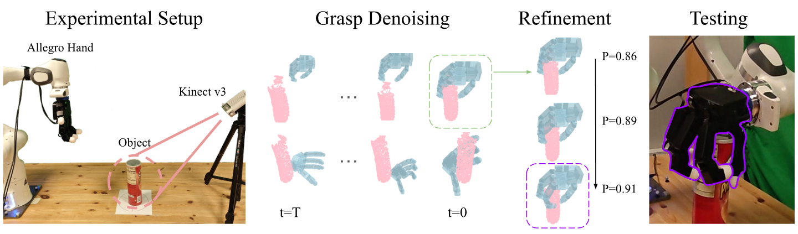
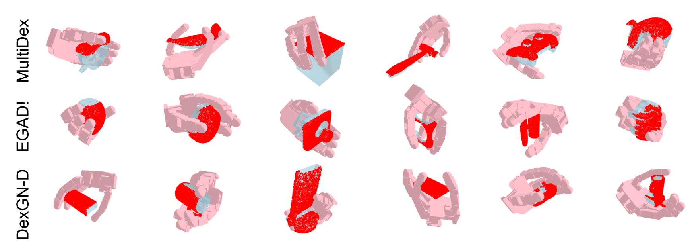

# DexDiffuser: Generating Dexterous Grasps with Diffusion Models 

This repository contains the PyTorch implementation of DexDiffuser. 

We introduce DexDiffuser, a novel dexterous grasping method that generates, evaluates, and refines grasps on partial object point clouds. DexDiffuser includes the conditional diffusion-based grasp sampler DexSampler and the dexterous grasp evaluator DexEvaluator. DexSampler generates high quality grasps conditioned on object point clouds by iterative denoising of randomly sampled grasps.


[Paper](https://ieeexplore.ieee.org/document/10753039) |
[ArXiv](https://arxiv.org/abs/2402.02989) |
[Project](https://yulihn.github.io/DexDiffuser_page/) |
[Checkpoints](https://drive.google.com/drive/folders/1geJ0jmjvlqQATZakMC41JafjMVBCIaIX?usp=sharing)

<div align="center">

</div>
Published in: IEEE Robotics and Automation Letters ( Volume: 9, Issue: 12, December 2024)


## Installation

1. Create a conda environment

```
conda create -n dexdiff python=3.8
conda activate dexdiff
```

2. Install CUDA 11.7

3. Install [pytorch3d](https://github.com/facebookresearch/pytorch3d/blob/main/INSTALL.md)
4. Install [bps_torch](https://github.com/otaheri/bps_torch)
5. Install dependencies
```
pip install omegaconf einops urdf-parser-py hydra-core loguru plotly tqdm transformations trimesh matplotlib pyrender tensorboard tqdm transforms3d
```
6. (optional) Install [IsaacGym](https://developer.nvidia.com/isaac-gym)

## Checkpoints & Data
[Checkoints for sampler and evaluator](https://drive.google.com/drive/folders/1nadKssm-HZA-c3RRlJKAPQnWzEwbGPU-?usp=sharing)

Place the weights in the `ckpts` folder

[Training data](https://drive.google.com/drive/folders/1pAfkVYeYUWfKs8TEAoppScO3IoHcYQML?usp=sharing)

Extract `object.zip` into the `data` folder. Place the `.pickle` file into the `dexdiffuser_data` folder.
## Train

Modify the path in config paths so that the model can find the data

Train the sampler
```
bash scprits/train_sampler.sh
```

Train the evalutaor
```
bash scripts/train_evaluator.sh
```

## Grasp Generation & Refinement & Test

generate grasps (set guid_scale to use EGD)
```
bash scripts/sample.sh
```

refine the generated grasps
```
bash scripts/refine.sh
```

(optional) test grasps in isaacgym
```
python isaac_test_right.py --eval_dir path_to_grasps
```


Some examples generated by DexDiffuser
<div align="center">

</div>

## Acknowledgments
This work was supported by the Swedish Research Council, the Knut and Alice Wallenberg Foundation, the European Research Council (ERC-BIRD-884807). The authors also would like to express their gratitude to Zheyu Zhuang for providing insightful feedbacks and to Ning Zhou for contributing an RTX 3090 graphics card.

## Citation
If you want to cite us:
```
@ARTICLE{10753039,
  author={Weng, Zehang and Lu, Haofei and Kragic, Danica and Lundell, Jens},
  journal={IEEE Robotics and Automation Letters}, 
  title={DexDiffuser: Generating Dexterous Grasps With Diffusion Models}, 
  year={2024},
  volume={9},
  number={12},
  pages={11834-11840},
  doi={10.1109/LRA.2024.3498776}}
```


## License

This project is licensed under the MIT License. See [LICENSE](LICENSE) for more details.


